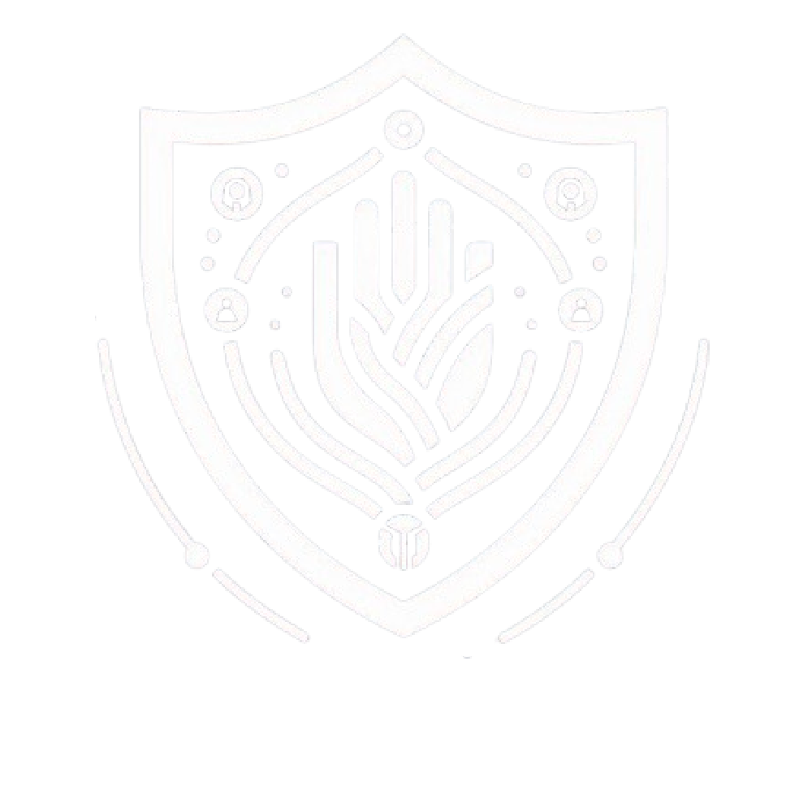

# ✨ GovAble - Innovation Challenge Microsoft ✨

 

---

## **📋 Objetivo del Proyecto**  
**GovAble** tiene como misión **empoderar a los gobiernos** para lograr una **inclusión digital universal**. Nuestra plataforma evalúa la **accesibilidad web** según los estándares **WCAG 2.1**, proporcionando resultados claros y prácticos para optimizar la experiencia de todos los usuarios, sin importar sus habilidades.

---

## **🚀 Funcionalidades Principales**  

- **Auditoría de Accesibilidad Web**:  
   Analiza sitios web ingresando una URL, mostrando un puntaje y áreas de mejora.  
- **Resultados Detallados**:  
   Evalúa la conformidad con principios clave:  
   - Perceptible ✅  
   - Operable ⚠️  
   - Comprensible ❌  
   - Robusto ✅  
- **Reporte Descargable**:  
   Exporta los resultados en un archivo **.txt**.  
- **Reiniciar Auditoría**:  
   Permite realizar una nueva auditoría de manera sencilla.

---

## **🎯 Cómo Ejecutar el Proyecto**  

1. **Clona el repositorio**:  
   En tu terminal ejecuta:  
   ```bash
   git clone https://github.com/LudwigAngel/GovAbleHackMicrosoft.git
   cd GovAbleHackMicrosoft
   ```

2. **Instala las dependencias**:  
   Asegúrate de tener **Node.js** y **npm** instalados. Luego ejecuta:  
   ```bash
   npm install
   ```

3. **Ejecuta el proyecto en local**:  
   ```bash
   npm start
   ```

4. **Visualiza la aplicación**:  
   Abre tu navegador y dirígete a:  
   ```
   http://localhost:3000
   ```

---

## **💻 Tecnologías Utilizadas**  

- **Frontend**: React.js con Material UI  
- **Estilización**: CSS personalizado + Material UI  
- **Estado**: Hooks de React (useState)  
- **Funcionalidad**: JavaScript (para lógica de simulación y descarga de reportes)

---

## **📄 Estructura del Proyecto**  

```plaintext
GovAbleHackMicrosoft/mi-app
│-- src/
│   ├── img/                # Imágenes del proyecto
│   ├── components/         # Componentes reutilizables
│   ├── HomePage.js         # Página principal
│   ├── App.js              # Componente raíz
│   ├── index.js            # Punto de entrada
│   └── styles/             # Estilos CSS
│
│-- package.json            # Configuración de dependencias
│-- README.md               # Este archivo :)
```

---

## **📸 Capturas de Pantalla**  

### **Sección de Auditoría**  


### **Resultados de Accesibilidad**  
 

---

## **💡 Sobre el Innovation Challenge de Microsoft**  

Este proyecto ha sido desarrollado como parte del **Innovation Challenge de Microsoft** para fomentar soluciones tecnológicas innovadoras que promuevan la inclusión y accesibilidad.  

---

## **🛏♥️ Equipo**  
- **Nombre del Participante**: Ludwig Angel Limache Mayta
- **LinkedIn**: https://www.linkedin.com/in/ludwig-angellimache/

---

## **🔗 Repositorio en GitHub**  
Encuentra el código fuente aquí: [GovAbleHackMicrosoft](https://github.com/LudwigAngel/GovAbleHackMicrosoft)  

---

## **💾 Descarga y Prueba**  

¡Sigue los pasos y prueba **GovAble**! 🚀  
Tu retroalimentación es bienvenida. 🎉  

---

**¡Gracias por evaluar nuestro proyecto! 🙌**  
